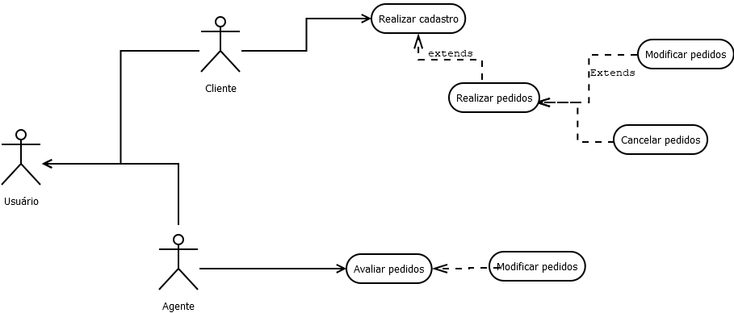

# -Laborat-rio-02---Sistema-de-Aluguel-de-Carros

## Requisitos

1. O sistema deve exigir um cadastro prévio antes que qualquer usuário possa utilizá-lo.
2. os clientes devem poder:

* * Introduzir novos pedidos de aluguel;
* * Modificar pedidos de aluguel existentes;
* * Consultar informações sobre seus pedidos de aluguel;
* * Cancelar pedidos de aluguel.

3. Os agentes devem poder:

* * Modificar pedidos de aluguel;
* * Avaliar pedidos de aluguel do ponto de vista financeiro;
* * Efetivar o contrato de aluguel (em caso de avaliação positiva).

4. O sistema deve armazenar dados dos contratantes de aluguel, como:

* * Identificação (RG, CPF, Nome, Endereço);
* * Profissão;
* * Entidades empregadoras;
* * Rendimentos auferidos (máximo 3).

5. Os automóveis alugados deverão poder ser registrados como propriedade de:

* * Clientes;
* * Empresas;
* * Bancos.

6. O sistema deverá registrar dados sobre os automóveis, como:

* * Renavam;
* * Ano;
* * Marca;
* * Modelo;
* * Placa.

7. O aluguel de um automóvel deverá poder ser associado a um contrato de crédito concedido por um dos bancos agentes;
8. O servidor central do sistema deverá estar ligado à Internet e ser acessível a partir dos computadores locais dos clientes e dos agentes aderentes.

## Diagrama de Caso de Uso

## Histórias de Usuário

>Eu como um usuário interessado em alugar um automóvel, desejo realizar um cadastro prévio no sistema para poder utilizar seus recursos e fazer pedidos de aluguel.
>
>Eu como usuário desejo poder introduzir, modificar, consultar e cancelar meus pedidos de aluguel.
>
>Eu como agente(empresas e bancos) devo ser capazes de modificar e avaliar os pedidos dos usuários.
>
>
>

## Diagrama de Classe

