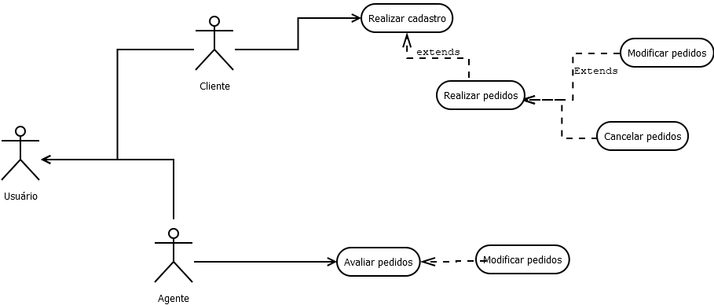

# -Laborat-rio-02---Sistema-de-Aluguel-de-Carros

## Diagrama de Caso de Uso

## Histórias de Usuário

>Eu como um usuário interessado em alugar um automóvel, desejo realizar um cadastro prévio no sistema para poder utilizar seus recursos e fazer pedidos de aluguel.
>
>Eu como usuário desejo poder introduzir, modificar, consultar e cancelar meus pedidos de aluguel.
>
>Eu como agente(empresas e bancos) devo ser capazes de modificar e avaliar os pedidos dos usuários. 
>
>
> 

## Diagrama de Classe
